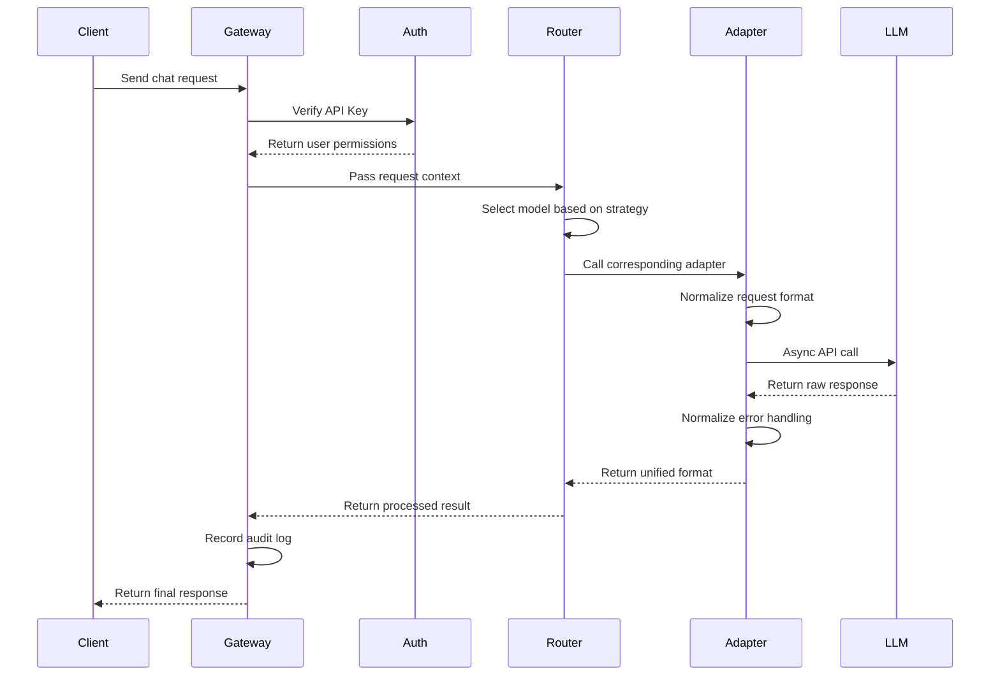

# LLM Bridge

[English](README.md) | [简体中文](docs/README-zh-CN.md)

LLM Bridge is a centralized service for managing and proxying API requests to large language models. It supports multiple providers and offers a unified API interface, simplifying the process of using and developing with various models.

## Features

- 🚀 Unified API interface compatible with OpenAI's format
- 🔄 Supports both streaming (SSE) and WebSocket connections
- 🛠 Supports multiple popular LLM providers:
  - OpenAI
  - Google Gemini
  - Deepseek
  - Other providers compatible with the OpenAI format
- 🔌 Flexible proxy configuration
- 📝 Structured JSON logging
- 🔑 API key management and authentication
- 📊 Token counting and usage statistics

## Quick Start

### Prerequisites

- Python 3.8+
- pip

### Installation

1. Clone the repository:
   ```bash
   git clone https://github.com/Rundao/LLM-Bridge.git
   cd llm-bridge
   ```

2. Install dependencies

   (Optional) Create a conda virtual environment:
   ```bash
   conda create -n llm-bridge python=3.12
   conda activate llm-bridge
   ```
   Install dependencies:
   ```bash
   pip install -r requirements.txt
   ```

3. Configure environment variables
   ```bash
   cp .env.example .env
   ```
   Then edit the `.env` file and fill in the necessary configurations:
   ```
   ACCESS_API_KEYS=your-access-key-1,your-access-key-2
   CLOSEAI_API_KEY=your-closeai-key
   GEMINI_API_KEY=your-gemini-key
   DEEPSEEK_API_KEY=your-deepseek-key
   ```
   Here, `ACCESS_API_KEYS` is used for authenticating API requests.
   The other keys correspond to the API keys for each provider.

4. Start the service
   ```bash
   cd src && uvicorn main:app --reload --port 1219
   ```
   The service will be available at http://localhost:1219.

## API Usage

### Chat Completion Endpoint

Example using curl:
```bash
curl http://localhost:1219/v1/chat/completions \
  -H "Content-Type: application/json" \
  -H "Authorization: Bearer your-access-key" \
  -d '{
    "model": "closeai/gpt-4o-mini",
    "messages": [{"role": "user", "content": "Hello"}],
    "stream": true
  }'
```

Example using [Cherry Studio](https://cherry-ai.com/):
- Click "Settings" in the bottom left corner.
- In "Model Provider", click "Add" and choose Provider Type as "OpenAI".
- Enter one of your `ACCESS_API_KEYS` in the "API Key" field.
- Enter `http://127.0.0.1:1219` in the "API URL" field.
    - Some software (such as [Cherry Studio](https://cherry-ai.com/)) will automatically supplement `/v1/chat/completions`, please adjust according to the actual situation
- Click "Manage" to add models.
- Check the connectivity and start using it.

### WebSocket Endpoint

Connect to the WebSocket endpoint at `/v1/ws` for real-time bidirectional communication:

```javascript
const ws = new WebSocket('ws://localhost:1219/v1/ws');

ws.onmessage = function(event) {
    console.log('Received:', event.data);
};

ws.send(JSON.stringify({
    type: 'chat',
    api_key: 'your-access-key',
    payload: {
        model: 'closeai/gpt-4o-mini',
        messages: [{role: 'user', content: 'Hello'}]
    }
}));
```

### Supported Models

Specify the provider by prefixing the model name. For example:
- CloseAI models: `closeai/gpt-4o`, `closeai/gpt-4o-mini`
- Gemini models: `gemini/gemini-2.0-pro-exp-02-05`
- Deepseek models: `deepseek/deepseek-chat`

You can use the `/v1/models` endpoint to retrieve a complete list of supported models.

## Request Flow



## Project Structure

```
llm-bridge/
├── configs/
│   └── config.yaml       # Global configuration
├── src/
│   ├── core/ 
│   │   ├── gateway/      # FastAPI-based request handlers
│   │   │   ├── http_handler.py    # REST API handler
│   │   │   └── websocket_handler.py
│   │   └── router.py     # Request routing
│   ├── adapters/
│   │   ├── base.py       # Abstract base class
│   │   ├── openai.py     # OpenAI format adapter
│   │   └── gemini.py     # Gemini API adapter
│   ├── infrastructure/
│   │   ├── config.py     # Configuration management
│   │   └── logging.py    # Structured logging
│   └── main.py           # Service entry point
├── docs/                 # Documentation
├── requirements.txt
└── README.md
```

## Configuration

### Model Configuration

Configure supported models and their settings in `configs/config.yaml`:
```yaml
providers:
  closeai:
    base_url: "https://api.openai-proxy.org/v1/chat/completions"
    requires_proxy: false
    models:
      gpt-4o:
        max_tokens: 8192
        timeout: 120
      gpt-4o-mini:
        max_tokens: 4096
        timeout: 60
```

### Logging Configuration

Configure logging settings in `configs/config.yaml`:
```yaml
logging:
  format: "json"  # json or text
  output:
    file:
      path: "logs/llm-bridge.log"
      max_size: 10485760  # 10MB
      backup_count: 5
    console: true
  level: "info"  # debug, info, warning, error
```

## Development Guidelines

### Adding a New Provider

1. Create a new adapter in `src/adapters/` that implements the `ModelAdapter` interface
2. Add the provider configuration to `configs/config.yaml`
3. Update the Router class to support the new adapter
4. Add corresponding API key to your `.env` file

### Error Handling

The service provides standardized error handling:
- 400: Bad Request (invalid parameters)
- 401: Unauthorized (invalid API key)
- 429: Too Many Requests (rate limit exceeded)
- 500: Internal Server Error

## License

MIT License

## Contributing

Contributions are welcome! Please submit your issues and pull requests to help improve the project.