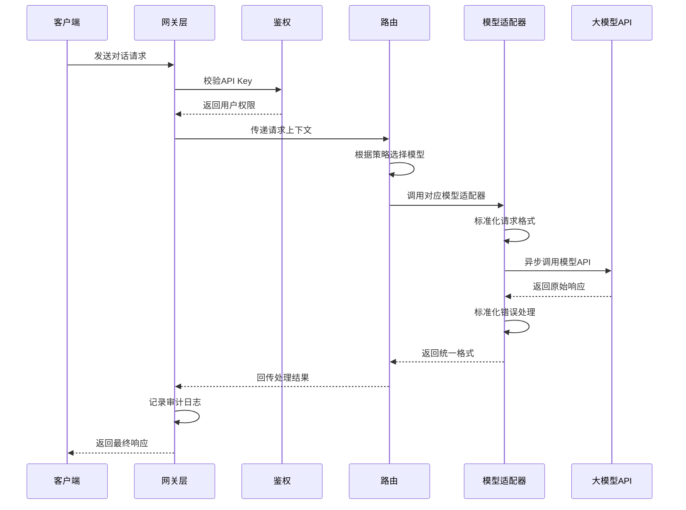

# LLM Bridge

[English](../README.md) | [简体中文](README-zh-CN.md)

LLM Bridge 是一个集中式的大语言模型 API 管理和转发服务。它支持多个提供商，并提供统一的 API 接口，简化了使用和开发各种模型的过程。

## 特性

- 🚀 统一的 API 接口，兼容 OpenAI 格式
- 🔄 支持流式响应（SSE）和 WebSocket 连接
- 🛠 支持多个主流大语言模型提供商：
  - OpenAI
  - Google Gemini
  - Deepseek
  - 其他兼容 OpenAI 格式的提供商
- 🔌 灵活的代理配置
- 📝 结构化 JSON 日志记录
- 🔑 API 密钥管理和认证
- 📊 Token 计数和使用统计

## 快速开始

### 环境要求

- Python 3.8+
- pip

### 安装步骤

1. 克隆仓库：
   ```bash
   git clone https://github.com/Rundao/LLM-Bridge.git
   cd llm-bridge
   ```

2. 安装依赖

   （可选）创建 conda 虚拟环境：
   ```bash
   conda create -n llm-bridge python=3.12
   conda activate llm-bridge
   ```
   安装依赖：
   ```bash
   pip install -r requirements.txt
   ```

3. 配置环境变量
   ```bash
   cp .env.example .env
   ```
   然后编辑 `.env` 文件，填入必要的配置：
   ```
   ACCESS_API_KEYS=your-access-key-1,your-access-key-2
   CLOSEAI_API_KEY=your-closeai-key
   GEMINI_API_KEY=your-gemini-key
   DEEPSEEK_API_KEY=your-deepseek-key
   ```
   其中，`ACCESS_API_KEYS` 用于验证 API 请求。
   其他密钥对应各个提供商的 API 密钥。

4. 启动服务
   ```bash
   cd src && uvicorn main:app --reload --port 1219
   ```
   服务将在 http://localhost:1219 上可用。

## API 使用

### 聊天补全接口

使用 curl 的示例：
```bash
curl http://localhost:1219/v1/chat/completions \
  -H "Content-Type: application/json" \
  -H "Authorization: Bearer your-access-key" \
  -d '{
    "model": "closeai/gpt-4o-mini",
    "messages": [{"role": "user", "content": "你好"}],
    "stream": true
  }'
```

使用 [Cherry Studio](https://cherry-ai.com/) 的示例：
- 点击左下角的"设置"
- 在"模型提供商"中，点击"添加"并选择"OpenAI"类型
- 在"API 密钥"字段中输入你的 `ACCESS_API_KEYS` 之一
- 在"API URL"字段中输入 `http://127.0.0.1:1219`
    - 某些软件（如 [Cherry Studio](https://cherry-ai.com/)）会自动补充 `/v1/chat/completions`，请根据实际情况调整
- 点击"管理"添加模型
- 检查连接并开始使用

### WebSocket 接口

连接到 `/v1/ws` WebSocket 端点以进行实时双向通信：

```javascript
const ws = new WebSocket('ws://localhost:1219/v1/ws');

ws.onmessage = function(event) {
    console.log('收到消息:', event.data);
};

ws.send(JSON.stringify({
    type: 'chat',
    api_key: 'your-access-key',
    payload: {
        model: 'closeai/gpt-4o-mini',
        messages: [{role: 'user', content: '你好'}]
    }
}));
```

### 支持的模型

通过前缀指定提供商。例如：
- CloseAI 模型：`closeai/gpt-4o`，`closeai/gpt-4o-mini`
- Gemini 模型：`gemini/gemini-2.0-pro-exp-02-05`
- Deepseek 模型：`deepseek/deepseek-chat`

你可以使用 `/v1/models` 接口获取完整的支持模型列表。

## 请求流程



## 项目结构

```
llm-bridge/
├── configs/
│   └── config.yaml       # 全局配置
├── src/
│   ├── core/ 
│   │   ├── gateway/      # 基于FastAPI的请求处理器
│   │   │   ├── http_handler.py    # REST API处理器
│   │   │   └── websocket_handler.py
│   │   └── router.py     # 请求路由
│   ├── adapters/
│   │   ├── base.py       # 抽象基类
│   │   ├── openai.py     # OpenAI格式适配器
│   │   └── gemini.py     # Gemini API适配器
│   ├── infrastructure/
│   │   ├── config.py     # 配置管理
│   │   └── logging.py    # 结构化日志
│   └── main.py           # 服务入口
├── docs/                 # 文档
├── requirements.txt
└── README.md
```

## 配置说明

### 模型配置

在 `configs/config.yaml` 中配置支持的模型及其设置：
```yaml
providers:
  closeai:
    base_url: "https://api.openai-proxy.org/v1/chat/completions"
    requires_proxy: false
    models:
      gpt-4o:
        max_tokens: 8192
        timeout: 120
      gpt-4o-mini:
        max_tokens: 4096
        timeout: 60
```

### 日志配置

在 `configs/config.yaml` 中配置日志设置：
```yaml
logging:
  format: "json"  # json 或 text
  output:
    file:
      path: "logs/llm-bridge.log"
      max_size: 10485760  # 10MB
      backup_count: 5
    console: true
  level: "info"  # debug, info, warning, error
```

## 开发指南

### 添加新的提供商

1. 在 `src/adapters/` 中创建实现 `ModelAdapter` 接口的新适配器
2. 在 `configs/config.yaml` 中添加提供商配置
3. 更新 Router 类以支持新适配器
4. 在 `.env` 文件中添加相应的 API 密钥

### 错误处理

服务提供标准化的错误处理：
- 400：请求错误（无效参数）
- 401：未授权（无效的 API 密钥）
- 429：请求过多（超出速率限制）
- 500：内部服务器错误

## 许可证

MIT 许可证

## 贡献

欢迎贡献！请提交 issues 和 pull requests 来帮助改进项目。
